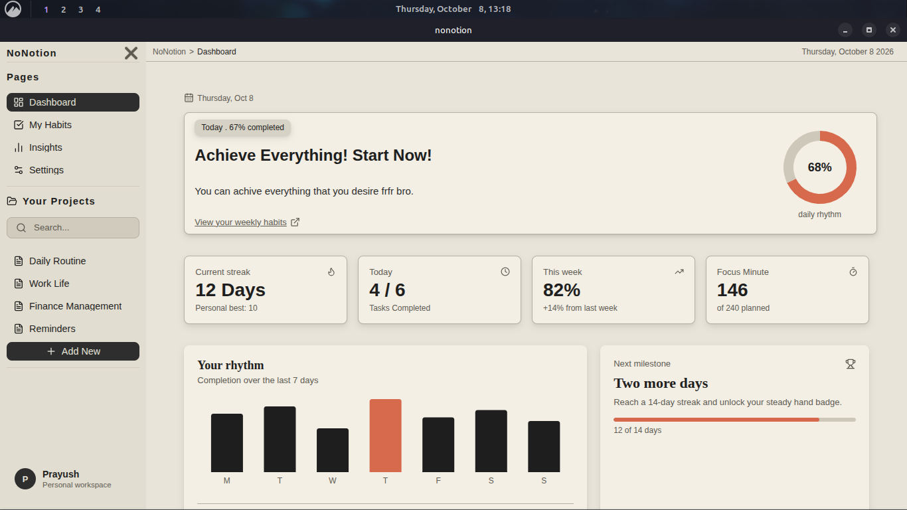

# NoNotion

> Definitely not a Notion clone.

A react app made for educational purpose, aming to learn the fundamentals of react apps, typescript and fullstack webapp development.

Even though the main purpose for this app is to learn, I am also making it to meet my needs as I have long needed a habit builder, tracker app that does not have hidden paywalls and have the features that I really wished for.

Most habit and productivity apps either lock core features behind paywalls or come with features I never asked for and then don't give me the one I'm truly seeking. Its just sucks.

---

## Tech Stack

| Layer     | Technology                   |
| --------- | ---------------------------- |
| Frontend  | React, TypeScript, HTML, CSS |
| Framework | Electron + Vite              |
| Backend   | Node.js                      |
| Database  | SQLite                       |

---

## Getting Started

> Setup instructions will be added once the project reaches a working state.

---

## Development Phases

**Phase 1 — Frontend**
Core UI, layouts, routing, and editor foundation.

**Phase 2 — Core Features**
Pages, editor blocks, organization, and local storage.

**Phase 3 — Productivity**
Tasks, habits, reminders, calendar, and dashboard.

---

## Features

### Pages

- [ ] Create, edit, delete, duplicate
- [ ] Nested pages
- [ ] Move pages
- [ ] Favorites / pinned pages
- [ ] Icons / covers
- [ ] Trash / restore
- [ ] Recent pages
- [ ] Breadcrumbs

### Editor

- [ ] Paragraphs
- [ ] H1 / H2 / H3
- [ ] Bulleted / numbered lists
- [ ] Checkboxes
- [ ] Quotes
- [ ] Code blocks
- [ ] Dividers
- [ ] Toggles
- [ ] Images / files
- [ ] Text formatting
- [ ] Links
- [ ] Undo / redo
- [ ] Drag & drop blocks
- [ ] Slash commands

### Organization

- [ ] Tags
- [ ] Search
- [ ] Sorting / filtering
- [ ] Favorites
- [ ] Backlinks
- [ ] Page linking
- [ ] Templates

### Productivity

- [ ] Tasks
- [ ] Due dates
- [ ] Priorities
- [ ] Reminders
- [ ] Recurring tasks
- [ ] Calendar
- [ ] Habit tracking
- [ ] Dashboard

### Storage

- [ ] Offline-first
- [ ] Local database
- [ ] Auto-save
- [ ] Import / export
- [ ] Backup

### Customization

- [ ] Light / dark mode
- [ ] Themes
- [ ] Font settings
- [ ] Editor width
- [ ] Sidebar customization
- [ ] Keyboard shortcuts
- [ ] Command palette

---

## Scope Note

This is a learning project. Features are listed in full to serve as a roadmap, not a promise. Some may never be implemented and that's fine.

---

`Project started: September 28, 2026`  
`Free to use — built for educational purposes`
